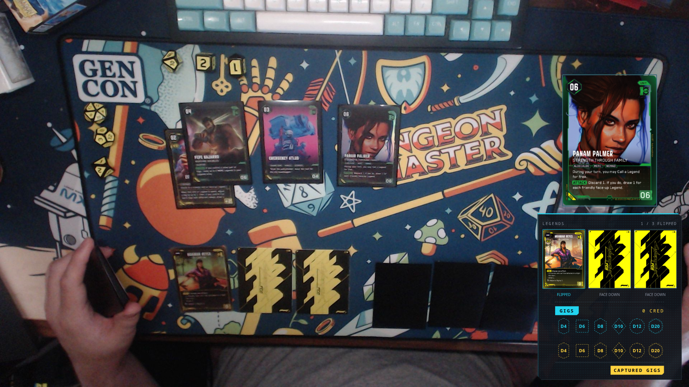
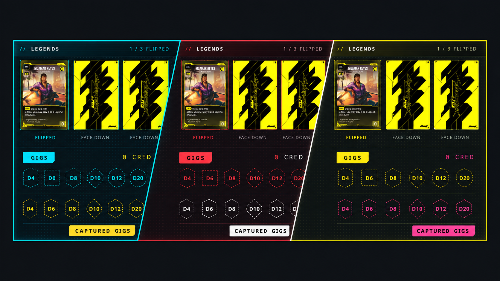
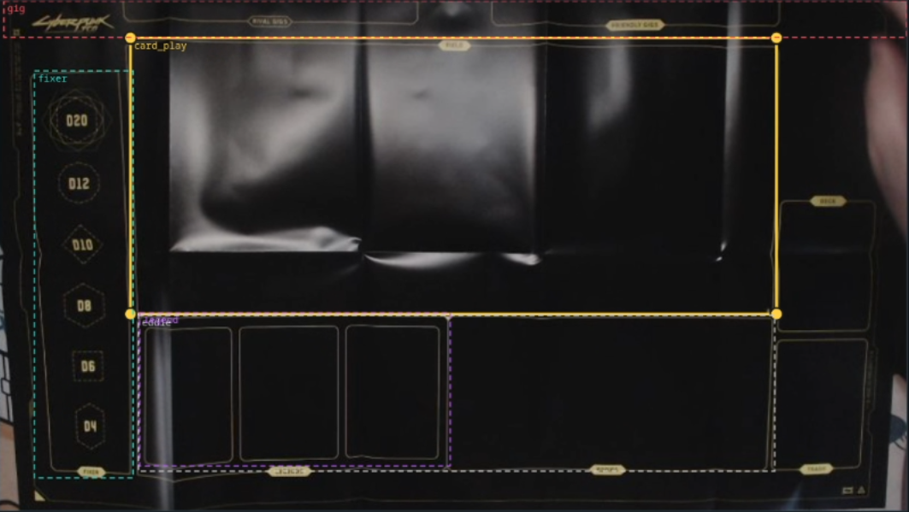

# Night City Broadcaster



*Minimal layout during webcam play.*

**A webcam companion for Cyberpunk TCG.** Track your latest play, revealed legends, and controlled gigs, then send your board to OBS through one browser source.

Night City Broadcaster runs locally on Linux and Windows. Use automatic card recognition, manual match controls, or both.

[Download](https://github.com/criticalkunic/Night-City-Broadcaster/releases/latest) · [Quick start](#quick-start) · [Illustrated guide](docs/getting-started.md) · [Video walkthrough](docs/assets/walkthrough.mp4) · [Getting started](#getting-started) · [Linux from source](#linux-from-source) · [OBS setup](#obs-setup) · [Troubleshooting](docs/troubleshooting.md) · [Building releases](desktop/README.md)

## Quick start

1. [Download the latest release](https://github.com/criticalkunic/Night-City-Broadcaster/releases/latest) and launch the Windows `.exe` or Linux `.AppImage` (make it executable first).
2. Wait for the app to open. First launch can take a little while before a window appears. Stay connected to the internet until the artwork download finishes.
3. In **Camera setup**, choose your webcam, start the camera, and set your board regions. See [camera setup](#3-set-up-your-camera) for details.
4. In **Player console**, set your name and manage your legends and gigs. In **Stream settings**, choose Minimal or Full board and click **Copy OBS stream link**.
5. In OBS, add a **Browser Source** and paste the link. **Set its Width and Height to the same resolution as your OBS output so the layout looks right**. For example, use **1920 × 1080** for a 1080p output. Match its frame rate to your webcam and keep the app running while streaming.

## Video walkthrough

[Watch the five-minute setup walkthrough](docs/assets/walkthrough.mp4), or follow the [illustrated guide](docs/getting-started.md) for camera zones, legend controls, gigs, and OBS.

## Features

- **Live card recognition.** Cards can be placed anywhere inside your configured play area. The latest recognized play appears as artwork, with a glitch reveal animation.
- **Three legend slots.** Track revealed legends, their positions and orientation, with animated flips and manual corrections.
- **Your gigs and captured gigs.** Edit dice values, return captured dice, and choose which panels appear on stream.
- **Two stream layouts.** Minimal places match information over your webcam. Full board arranges cropped play and Eddie video alongside legends, gigs, and an optional fixer panel.
- **One OBS URL.** Switch layouts without replacing your browser source. Choose Cyberpunk, Arasaka, or Edgerunners colors.
- **Match controls.** Start a new match, select cards manually, and step back through up to 100 recent card plays.
- **Recognition tools.** Inspect detections, adjust the image used by vision, and teach alternate artwork from a camera sample.

## Color schemes



*Cyberpunk, Arasaka, and Edgerunners, from left to right. Choose a color scheme in **Stream settings**; it applies to both Minimal and Full board.*

## Getting started

### 1. Download and launch

Download the file for your system from the [Releases page](https://github.com/criticalkunic/Night-City-Broadcaster/releases). Choose the application asset, not GitHub’s automatically generated source ZIP.

| System | Download | Launch |
| --- | --- | --- |
| Windows x64 | `Night City Broadcaster-<version>-Windows.exe` | Double-click to launch. Saved data stays in AppData. |
| Linux x64 | `Night City Broadcaster-<version>.AppImage` | Mark it executable in file properties, then double-click. |

Windows extracts its runtime into a temporary folder while running. You can keep the `.exe` wherever you like; settings and artwork are stored in AppData. Close the app before replacing it with a newer version.

**Platform support:** I use Linux and can only test the app on Linux. A Windows build is provided and should work in theory, but I can’t verify it on Windows. Reports from Windows users are welcome.

Windows builds are currently unsigned. Linux builds made by the release workflow target Ubuntu 22.04; locally built AppImages may require a newer distribution.

The standalone app checks GitHub for a newer stable build on launch. If one is available, choose **Open download page** or **Later**. Updates are downloaded manually; a failed check does not block the app.

**First launch may take a little while before any window appears.** Wait for the app to open rather than launching it again. Windows first unpacks the portable application into a temporary folder; a launch notice appears during extraction, followed by the startup screen. Python and required packages are included; nothing needs to be installed separately.

### 2. Prepare the artwork

On first launch, the app fetches the current card catalog, downloads card images and alternate references, and prepares recognition. It also downloads the card back used for hidden legends.

Keep an internet connection until setup finishes. The app stays on the progress screen until all required artwork is ready. If a download fails, retry; completed downloads are reused. There is no fixed card-count limit and no artwork bundled with the app.

### 3. Set up your camera

First time? Accept the **camera setup walkthrough** on the Player console, or open **Camera setup → Camera setup walkthrough** any time. A focused setup window shows your webcam with short instructions and animated examples. It selects each area for you and saves as you continue through mat corners and zones. A game mat with clearly defined zones is recommended.

1. Open **Camera setup**, choose your webcam or capture device, and click **Start camera**.
2. Select **Camera framing** and adjust the visible board area. Use **Straighten the board** if the camera views it at an angle.
3. Select **Played cards** and draw a region covering the area where you play cards. It can contain multiple cards; it is not a single-card presentation slot.
4. Select **Legends** and align the region with your three legend positions. Configure **Eddies**, **Gigs**, and **Fixer** if you use their video panels.
5. Click **Save camera setup**.



*Match the regions to your mat’s printed zones. See the [illustrated guide](docs/getting-started.md) for each step.*

Use even lighting and keep card faces clear of glare. Brightness and contrast controls adjust the image used for recognition without changing the broadcast video. For camera and frame-rate problems, see [Troubleshooting](docs/troubleshooting.md).

### 4. Run your match

Open **Player console** to set your name and manage the board.

- Play cards within the configured area. Tracking runs continuously; starting a new match does not require an empty-board calibration.
- Use **Choose a card manually** to correct a match or display a card without camera recognition.
- Assign legends and use their flip controls when a detection needs correcting.
- Click a die in **My gigs** or **Captured gigs**, then choose its value from the visual picker. Use the die with the red X to remove it. Add an opponent’s die only when you capture its gig.
- Use **Undo** to step back or **Start new match** to reset match state. Cards still visible on the table can be detected again after a reset.

Recognition depends on camera resolution, sleeves, lighting, and the available artwork references. Manual controls remain available during play.


Alternate artwork can be enabled under **Stream settings → Match artwork to the detected card**. This applies to the latest card and revealed legends in both layouts and the player console. When no official alternate artwork matches, regular artwork is used.

## Phone controls

In **Player console**, click **Phone controls** and scan the QR code with your phone. The controls open in your browser immediately, with no pairing or account. Both devices must be on the same Wi-Fi or LAN. Keep the desktop app running.

Change gigs, flip or assign legends, correct the latest card, undo changes, or start a match. Changes sync with the broadcast. Anyone on your LAN with the link can control the match; camera setup and maintenance stay on the PC. Click **Stop phone access** to disconnect phones. Phone access starts only when you open its panel and stops when the app closes.

If the page won’t open, allow the app through your firewall on private networks and avoid guest Wi-Fi with device isolation. Select another network address in the QR panel if needed. Rescan after changing networks or restarting the app.

## OBS setup

For a straightened mat in Minimal, enable **Use perspective-corrected board** in **Stream settings → Camera output**. Set the mat corners in Camera setup first. Full board already corrects its cropped video panels.

1. Open **Stream settings** and click **Copy OBS stream link**.
2. In OBS, add a **Browser Source** and paste the URL.
3. Set the Browser Source **Width** and **Height** to match your OBS output resolution so the layout looks right. For example, use **1920 × 1080** for a 1080p output. Set its frame rate to your camera’s rate, such as **30 FPS**.
4. Keep Night City Broadcaster running while streaming.

The usual URL is `http://127.0.0.1:8766/broadcast/live`. The desktop app selects another port if that one is occupied, so use the link shown in the app.

Choose **Minimal** or **Full board** in Stream settings. Both use the same output URL and share the card, legend, and gig visibility settings. Minimal supports all four corners and a scale control. Full board can hide the fixer and Eddie panels and use tracked dice instead of video for gigs.

The webcam video rate and the card-detection rate are separate. Recognition can run more slowly than the video without reducing the stream to that detection rate.

## Linux from source

Requires **Python 3.12 or newer**, Python’s `venv` support, and an internet connection for dependencies and first-launch artwork. Node.js and Electron are not needed for this method.

Download and extract the source, or clone the repository. Open a terminal in its folder:

```bash
chmod +x start.sh
./start.sh
```

`start.sh` creates `.venv`, installs the Python requirements, and starts the service. Open **http://localhost:8766/operator** in your browser. The same first-launch artwork setup and camera workflow apply. Stop the service with **Ctrl+C** in the terminal.

On Ubuntu or Debian, install the Python venv package if it is missing:

```bash
sudo apt install python3-venv
```

Check `python3 --version` first; older distributions may need a newer Python installation. On Fedora, Python normally includes venv support.

### Launch options

```bash
# Use another port if 8766 is occupied.
PORT=9000 ./start.sh

# Allow OBS on another computer to reach the service.
HOST=0.0.0.0 ./start.sh

# Keep downloaded artwork and configuration outside the source folder.
NCB_DATA_DIR="$HOME/.local/share/night-city-broadcaster" ./start.sh
```

The default is local access only. LAN mode has no login or access control; use it only on a trusted network. On the OBS computer, replace `localhost` in the stream URL with the host computer’s LAN address.

## Settings and downloads

| Launch method | Saved data |
| --- | --- |
| Windows standalone | `%APPDATA%\Night City Broadcaster` |
| Linux standalone | `~/.config/Night City Broadcaster` |
| `start.sh` | `config/`, `app/cards/`, and `captures/` inside the source folder |
| Custom `NCB_DATA_DIR` | The directory you specify |

Existing desktop installs continue using their original `Night City Broadcast` data folder, so settings, artwork, and saved player names carry over. Fresh installs use `Night City Broadcaster`.

Back up these folders to preserve camera settings, downloaded images, and learned artwork. Match state is not a saved-game file. Your player name is stored in browser cookies.

In **Debug**, use **Check for new cards** to fetch the current catalog, add new card identities, and download their images and alternate artwork. Progress is shown while it runs, and recognition refreshes automatically. No restart or terminal is required. Existing cards, images, and learned references are preserved. **Download missing card art** remains available to repair images for cards already in your catalog.

## Release notes

See [CHANGELOG.md](CHANGELOG.md) for changes in each release.

## Development and support

- [Troubleshooting and bug reports](docs/troubleshooting.md)
- [Development, tests, and source releases](docs/development.md)
- [Desktop packaging](desktop/README.md)
- [Contributing](CONTRIBUTING.md)

When reporting a recognition problem, include the app version, operating system, camera model, and a Debug crop showing the problem. Check captures for anything private before attaching them.

## License

Project code is licensed under [GNU GPL v3.0](LICENSE) (`GPL-3.0-only`). Third-party dependencies retain their own licenses.

## Artwork and trademarks

Night City Broadcaster is an unofficial community project. Cyberpunk TCG, Cyberpunk, and their associated artwork and trademarks belong to their respective owners, including CD PROJEKT RED, WeirdCo, and R. Talsorian Games. This project is not affiliated with or endorsed by CD PROJEKT RED, WeirdCo, or R. Talsorian Games.

Card metadata and images are downloaded from external services at runtime. The downloadable artwork library is excluded from source archives and standalone builds. Card artwork shown in the README screenshots belongs to its respective owners and is not covered by the code license. Download availability depends on those services.

## Deck showcases

New in **1.1 Beta**. We’re taking ideas for improving deck recordings and presentation controls. Share yours in [GitHub Issues](https://github.com/criticalkunic/Night-City-Broadcaster/issues).

Choose **Showcasing a deck** using the header activity switch to prepare a top-down deck walkthrough. **Playing over webcam** keeps the existing Minimal and Full Board match layouts. Switching activities preserves your match and deck.

1. Set up your overhead camera in **Camera setup**.
2. Add cards by searching, or import a list with one entry per line, such as `3 Panam Palmer: Strength Through Family`. Exports from **cyberpunktcg.com** (`// Legends` sections) and **cyberpunk-tcg-sim.online** (`# Legends`, numbered cards, and `1x` counts) are supported. Use full names with subtitles when names repeat. An import replaces the deck only after every line passes validation.
3. Set quantities, assign sections, reorder cards, and add on-stream reasoning with each card’s **Reasoning** button. The reasoning panel appears only for cards with a note, when **Card reasoning** is enabled.
4. Select a card, then use **Previous** and **Next** as you talk. Turn on **Show latest detected card** to follow recognized cards in your deck. Clicking a card selects it until a new card is detected; **Follow camera** releases your selection immediately.
5. Record the existing `/broadcast/live` Browser Source in OBS. Match its resolution to your OBS output. Your phone controls automatically become presentation controls in this activity.

The showcase puts your top-down camera beside large card artwork, copy counts and section progress. Its webcam can use your saved perspective correction from **Stream settings**.

### Showcase metrics

Use the **Card types**, **Top tags**, and **Cost curve** tiles on your desktop or phone to put a metric in the broadcast side panel. Filter charts by card color or type, sort by count or name/cost, and choose how many tags to show. Filters apply on both the phone and desktop and are labeled on the broadcast. Choose **Card** to restore the artwork. In Full showcase, the webcam stays in its own 16:9 area; Minimal showcase places compact panels over a full-frame camera. Other source aspect ratios are letterboxed without stretching or cropping.

Metrics count copies in the main deck and exclude legends, which are counted separately. Card types include a donut chart and color-split bars. The top five classification tags use color-split counts; cards with multiple tags can contribute to several bars. The cost curve shows printed costs, color splits, and the copy-weighted average. Unknown costs and missing catalog cards are labeled rather than treated as zero.


In **Camera setup**, Deck showcase uses a single **Board area** for recognition instead of the match zones. Set your mat’s perspective, mark the board area, and enable latest-card detection if you want the camera to advance the artwork.

Use **Save timestamped copy** to keep a deck for another recording. Saved copies include quantities, card reasoning, and display settings. Choose a copy by its title and date to recall it.

**Display options** lets you start with Full showcase, Minimal showcase, Right bar only, or Board only, then hide individual elements. Hidden areas are transparent in OBS. Minimal showcase fills the frame with your camera and uses translucent, softly blurred panel backgrounds. Use **Draw on board** to highlight cards or explain a combo. Undo or clear drawings when you move on. Display controls are also available on your phone; drawing is done on the desktop.
