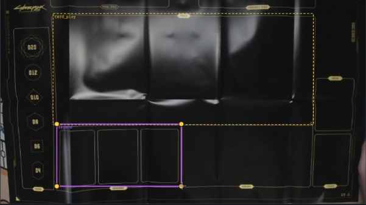
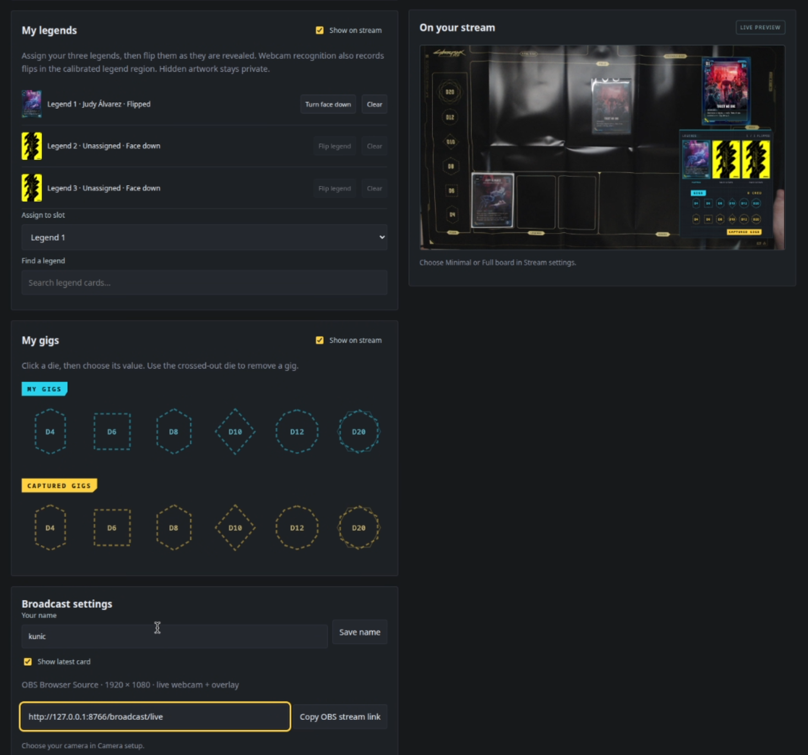

# Set up your first broadcast

[Watch the video walkthrough](assets/walkthrough.mp4) · [Back to the README](../README.md)

The video walks through camera setup and the player console in about five minutes. You can follow along below at your own pace.

## Before you start

Download the app for your system from [Releases](https://github.com/criticalkunic/Night-City-Broadcaster/releases/latest). On Linux, make the AppImage executable before opening it. On Windows, open the portable EXE.

The first window can take a little while to appear. Keep the app open and connected to the internet while it downloads the card catalog and artwork.

Use a game mat if you can. Printed zones make it easier to keep your cards in the right places. Mount the camera securely, keep the whole mat in view, and light it evenly. Avoid bright reflections on sleeves.

## 1. Start your camera

Open **Camera setup → Camera setup walkthrough**. The walkthrough chooses each area for you; use **Continue** or **Save & continue** to move through it.

Choose your webcam and click **Start camera**. If the board is upside down, turn on **Rotate camera 180°** before setting the zones.

Short exposure is the default because it helps keep motion smooth. If the picture is dark, add light to the mat. Under **More source options**, automatic exposure can improve brightness, but may lower the camera frame rate. Click **Start camera** again after changing exposure.

## 2. Straighten the board

Drag the four handles onto the four corners of your game mat, clockwise from the top left. Match the mat, not the edges of the camera picture or the desk.

This corrects the view from an angled camera so your board is easier to read. Without a mat, use the corners of a fixed rectangular play space. Save and continue before marking your zones.

## 3. Mark the played-card area

Fit the yellow box around the area where you play cards. Cards can go anywhere inside it; you do not need to place each new card in a particular slot. Keep the legends outside this area.

*The yellow box covers the play area. This overview also shows the other board zones; the guided setup introduces those one at a time.*

If your mat has printed zones, match them. Otherwise, choose places you will remember and use them consistently during every game.

## 4. Mark your legends

Fit the legend box around the three legend positions. The app divides it into three equal slots, from left to right. Center one legend in each third and avoid overlapping the cards.

*The legend row stays separate from played cards. The earlier play area remains visible as a dotted outline while you adjust the legends.*

## 5. Set the remaining zones

Continue through **Eddies**, **Gigs**, and **Fixer**. Fit each box around its printed zone, or the place where you keep those cards or dice. Earlier zones remain visible as dotted outlines.

The full-board layout uses these areas for video close-ups. If you track dice manually, choose **Use my tracked dice** in Stream settings instead of using camera crops for gigs and fixer dice. You can also hide the fixer and Eddie panels.

Finish the walkthrough to save your setup. If you move the camera or mat later, check the corners and zones again.

## 6. Try a card and manage your gigs

Open **Player console** and place a card in the played-card area. Its recognized artwork should appear in the stream preview. If recognition needs correcting, use **Choose a card manually**.

Legends are tracked in their row. The manual legend controls let you assign a card to a slot, flip it, or turn it face down when needed.

*The player console brings together legend controls, your gigs, captured gigs, and a preview of the broadcast.*

For gigs:

1. Click a die in **My gigs**.
2. Choose its value from the visual picker. The tray and stream update together.
3. When you capture an opponent’s gig, select its die in **Captured gigs** and choose its value.
4. To remove a gig, click the die again and choose the die with the red X.

Faded dice are not currently controlled. Both trays always remain available in the console; **Show on stream** controls whether gigs appear in the broadcast.

## 7. Add the broadcast to OBS

In **Stream settings**, choose **Minimal** or **Full board**, then click **Copy OBS stream link**. Add a **Browser Source** in OBS and paste that link.

**Set the Browser Source width and height to the same resolution as your OBS output.** For a 1080p output, use **1920 × 1080**. Match the source frame rate to your webcam, such as **30 FPS**.

Keep Night City Broadcaster running while streaming. Both layouts use the same URL, so you can switch between them without replacing the OBS source.

If something does not look right, see [Troubleshooting](troubleshooting.md).
